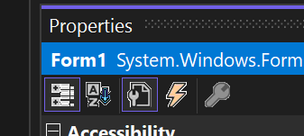

# .NET
- .NET nám všeobecne dovoľuje vytvárať okrem konzolových aplikácií aj oknové/desktopové (Windows Forms, WPF), webové (ASP.NET: MVC, Razor, Blazor apod.) či mobilné (MAUI)

# Windows Forms
- framework slúžiaci na návrh frontendu aj backendu oknových aplikácií
- oproti WPF legacy technológia

## Prostredie
- viď Solution Explorer: defaultne sa vytvoria tri .cs súbory: Program.cs, (defaultne) Form1.cs a Form1.Designer.cs

### Program.cs
- štartovacie miesto aplikácie, všeobecne sa tam môže aj zvoliť aj ktorý formulár (okno) sa spúšťa defaultne
```cs
namespace Kalkulacka
{
    internal static class Program
    {
        /// <summary>
        ///  The main entry point for the application.
        /// </summary>
        [STAThread]
        static void Main()
        {
            // To customize application configuration such as set high DPI settings or default font,
            // see https://aka.ms/applicationconfiguration.
            ApplicationConfiguration.Initialize();
            Application.Run(new Form1());
        }
    }
}
```

### Form1.cs
- má dve verzie, Code a Designer, medzi ktorými sa prechádza po kliknutý pravým -> View Code alebo View Designer

#### Designer
- vo VS a v Rideri nám IDE povoľuje drag-and-drop návrh okna pomocou GUI
- prvky, ktoré môžeme vkladať do priestoru okna, sú v Toolboxi (View -> Toolbox)
- každý prvok má svoju sadu vlastností a udalostí, ku ktorým sa dá pristupovať cez klik pravým na prvok -> Properties

- prvé dve ikony definujú spôsob akým sú vlastnosti/udalosti vymenované (prvá ikona kategoricky, druhá ikona abecedne), druhé dve ikony slúžia na prehadzovanie medzi vlastnosťami a udalosťami
- všetky vlastnosti tu definované sú nastavované na defaultnú hodnotu, dajú sa meniť (defaultne aj počas behu programu) v kóde

#### Code
- tu je popísaná logika programu a jednotlivých prvkov
- defaultne je v kóde iba konštruktor
```cs
namespace Kalkulacka
{
    public partial class Form1 : Form
    {
        public Form1()
        {
            InitializeComponent();
        }
    }
}
```

### Form1.Designer.cs
- tu je popísaná štruktúra okna, sú tu vymenované všetky vlastnosti a udalosti a ich **súčasné** hodnoty
- kód v tomto súbore sa automaticky aktualizuje podľa zmien v dizajnovej časti Form1.cs

## Vlastnosti
- hodnoty, ktoré definujú predovšetkým vzhľad prvku
- mnohé z nich sú spoločné pre viacero alebo všetky prvky, niektoré sú jedinečné pre daný prvok
- **(Name)** - meno prvku, pomocou ktorého k nemu pristupujeme v kóde
  - na vizuálnu stránku nemá žiadny vplyv, je ho však vhodné a odporúčané meniť predovšetkým vzhľadom na narastajúci počet prvkov
- **Text** - text asociovaný s daným prvkom, ktorý je zobrazený pri alebo v danom prvku
  - vždy `string`
- **Enabled** - určuje prístup používateľa k prvku
  - pri `false` je prvok viditeľný ale neprístupný
- **Visible** - určuje viditeľnosť prvku
  - pri `false` je prvok neviditeľný
- ďalšie vlastnosti sa týkajú fontu, pozadia, farby, polohy, veľkosti a podobne

## Udalosti
- metódy, ktoré sa vyvolajú po konkrétnej interakcii používateľa s prvkom
- vytvárajú sa buď dvojklikom na konkrétnu udalosť v Properties okne (klik pravým na prvok -> Properties -> Events), prípadne jedna konkrétna udalosť je pre daný prvok "typická" a dá sa vytvoriť dvojklikom na daný prvok (napr. pre `Button` je to `Click`)
- v kódovej časti sa automaticky vytvorí metóda, ktorá je `private`, `void`, meno je zložené z názvu prvku a udalosti a má dva parametre, `sender` typu `object` a `e` typu `EventArgs` (alebo `KeyEventArgs` alebo `MouseEventArgs`)
```cs
        private void buttonVypocitaj_Click(object sender, EventArgs e)
        {

        }
```
- tip: ak omylom vytvoríte udalosť, nevymazávajte inštiktívne jej kód; ak ju chcete odstrániť, v Properties okne sa vytvorenú udalosť kliknite pravým -> Reset
  - ak jej kód vymažate, vrátťe ho naspäť a Build -> Rebuild Solution

## Základné prvky
### Button
- tlačidlo
- najpoužívanejšia udalosť je `Click` (kliknutie)

### Label
- text (štítok) bez používateľskej interakcie

### TextBox
- textové pole
- najčastejšie sa z neho preberá alebo do neho vkladá nejaký text
- najpoužívanejšia udalosť je `TextChanged` (pridanie alebo odstránenie znaku)
- môže byť aj viacriadkové pri nastavení vlastnosti `Multiline` na `true`, spravidla so scrollbarom cez `ScrollBars` na `Vertical` (alebo `Horizontal` alebo `Both`)

### ComboBox
- rolovacia ponuka na výber z viacerých možností
- najpoužívanejšia udalosť je `SelectedIndexChanged`
- defaultne sa dá do neho písať, na zmenu čoho slúži vlastnosť `DropDownStyle` (hodnota `DropDownList` z neho spraví read-only)
- k jednotlivým prvkom sa dá v kóde pristupovať cez vlastnosti ako `SelectedIndex` a `SelectedItem`
- v Properties okne sa do neho dá vkladať defaultná hodnota prvkov cez vlastnosť `Items`, v praxi je však vhodnejšie tieto prvky definovať v kóde
  - `Items` sa správa ako zoznam, takže nové prvky sa dajú vkladať cez metódu `Add`
  - v praxi sa bežne nastavuje aj ktorý prvok bude zobrazený (zvolený) ako defaultný
```cs
        public Form1()
        {
            InitializeComponent();
            comboBoxOperacie.Items.Add("+");
            comboBoxOperacie.Items.Add("-");
            comboBoxOperacie.Items.Add("*");
            comboBoxOperacie.Items.Add("/");
            comboBoxOperacie.SelectedIndex = 0;
        }
```

### NumericUpDown
- výber čísla z rozsahu pomocou šípok
- rozsah a krok sa určujú na základe vlastností `Minimum`, `Maximum` a `Increment`
- najpoužívanejšia udalosť je `ValueChanged`

### CheckBox a RadioButton
- začiarkavacie políčka, 
  - pri `CheckBox` sa zo skupiny dá zvoliť ľubovoľný počet
  - pri `RadioButton` sa zo skupiny dá zvoliť presne jedno
- najpoužívanejšia udalosť je `CheckedChanged`
- boolová vlastnosť, ktorá označuje začiarknutie políčka, je `Checked`

### MenuStrip
- hlavná ponuka dostupná v hornej lište
- udalosti sa vytvárajú ku každému "tlačidlu"